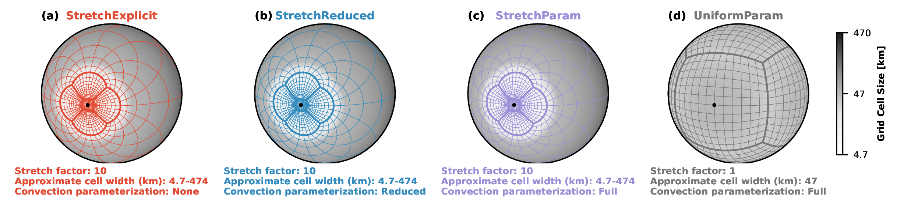

<p align="center">
</a>
</p>

<h1 align="center">
The impact of the explicit representation of convection on the climate of a tidally locked planet in global stretched-mesh simulations.
</h1>
<p align="center">
<a href="https://arxiv.org/abs/2402.19277">
</a>
</p>
<p align="center">
<a href="https://www.python.org/downloads/">
</a>
<a href="https://github.com/psf/black">
</a>
</p>


<h2 align="center">Repository contents</h2>

Notebooks and Python scripts are in the [`src/scripts/`](src/scripts/) directory, while the figures themselves are in the [`src/figures/`](src/figures/) directory.

|  #  | Figure | Notebook |
|:---:|:-------|:---------|
|  1  | [Summary of the simulation setup](src/figures/regr__hab1_mod_c192_s10e_s10r_s10p_p__cell_width__c12_mesh__summary.pdf) | [Show-Mesh-And-Cell-Sizes.ipynb](https://nbviewer.jupyter.org/github/dennissergeev/stretched_mesh_code/blob/main/src/scripts/Show-Mesh-And-Cell-Sizes.ipynb) |
|  2  | [Clouds and precipitation in the simulations with stretched and quasi-uniform mesh](src/figures/combi_hab1_mod_c192_s10e_s10r_s10p_p__inst_diag__tot_col_m_c_tot_prec__grat__precip_sum_hist__cloud_types.pdf) | [Cloud-Precip-Snap-Hist.ipynb](https://nbviewer.jupyter.org/github/dennissergeev/stretched_mesh_code/blob/main/src/scripts/Cloud-Precip-Snap-Hist.ipynb) |
|  3  | [Meridional and time mean profiles of vertically integrated moisture diagnostics](src/figures/regr__hab1_mod_c192_s10e_s10r_s10p_p__tot_col_m_v_tot_col_m_c_tot_col_m_cl_tot_col_m_ci__tmm.pdf) | [Meridional-Mean-Cloud-Profiles.ipynb](https://nbviewer.jupyter.org/github/dennissergeev/stretched_mesh_code/blob/main/src/scripts/Meridional-Mean-Cloud-Profiles.ipynb) |
|  4  | [Vertical profiles of time mean diagnostics in the substellar region](src/figures/regr__hab1_mod_c192_s10e_s10r_s10p_p__tot_col_m_v_tot_col_m_c_tot_col_m_cl_tot_col_m_ci__tmm.pdf) | [Substellar-Vertical-Profiles.ipynb](https://nbviewer.jupyter.org/github/dennissergeev/stretched_mesh_code/blob/main/src/scripts/Substellar-Vertical-Profiles.ipynb) |
|  5  | [Thermodynamic and circulation regime](src/figures/regr__hab1_mod_c192_s10e_s10r_s10p_p__t_sfc_toa_olr_u_zm__w_zm_day__tm_map.pdf) | [Thermodynamic-And-Circulation-Regime.ipynb](https://nbviewer.jupyter.org/github/dennissergeev/stretched_mesh_code/blob/main/src/scripts/Thermodynamic-And-Circulation-Regime.ipynb) |
|  6  | [Maps of precipitation rate](src/figures/regr__hab1_mod_c192_s10e_s10r_s10p_p__tot_prec_ls_prec_conv_prec__tm_map.pdf) | [Precipitation-Maps.ipynb](https://nbviewer.jupyter.org/github/dennissergeev/stretched_mesh_code/blob/main/src/scripts/Precipitation-Maps.ipynb) |
|  7  | [Circulation regime bistability](src/figures/thai_hab1__c192_s10e_s10r_s10p_p__inst_diag__toa_osr__t_sfc__wind_08160m.pdf) | [Show-Bistability.ipynb](https://nbviewer.jupyter.org/github/dennissergeev/stretched_mesh_code/blob/main/src/scripts/Show-Bistability.ipynb) |


<h2 align="center">How to reproduce figures</h2>

<h3 align="center">Set up environment</h3>

To recreate the required environment for running Python code, follow these steps. (Skip the first two steps if you have Jupyter with `nb_conda_kernels` installed already.)

1. Install conda or mamba, e.g. using [miniforge](https://github.com/conda-forge/miniforge).
2. Install necessary packages to the `base` environment. Make sure you are installing them from the `conda-forge` channel.
```bash
mamba install -c conda-forge jupyterlab nb_conda_kernels conda-lock
```
3. Git-clone or download this repository to your computer.
4. In the command line, navigate to the downloaded folder, e.g.
```bash
cd /path/to/downloaded/repository
```
5. Create a conda environment from the lock file.
```
conda-lock install --name stretched_mesh_env conda-lock.yml
```

<h3 align="center">Open the code</h3>

1. Start the Jupyter Lab, for example from the command line (from the `base` environment).
```bash
jupyter lab
```
2. Open notebooks in the `stretched_mesh_env` environment start running the code.

<h2 align="center">
System information
</h2>

--------------------------------------------------------------------------------
  Date: Tue Apr 30 11:43:52 2024 BST

                OS : Linux
            CPU(s) : 56
           Machine : x86_64
      Architecture : 64bit
               RAM : 502.6 GiB
       Environment : Python
       File system : ext4

  Python 3.12.3 | packaged by conda-forge | (main, Apr 15 2024, 18:38:13) [GCC
  12.3.0]

             numpy : 1.26.4
             scipy : 1.13.0
           IPython : 8.22.2
        matplotlib : 3.8.4
            scooby : 0.9.2
--------------------------------------------------------------------------------

```bash
python -c 'import scooby; print(scooby.Report())'
```
